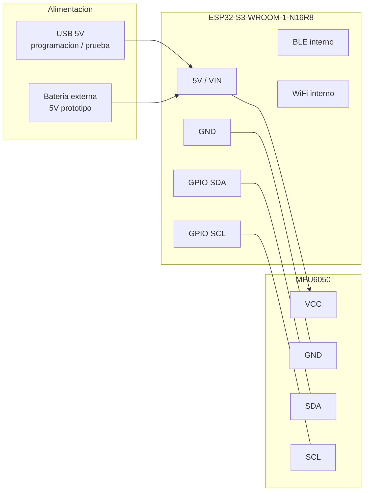
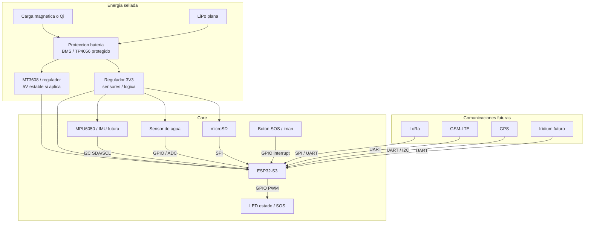
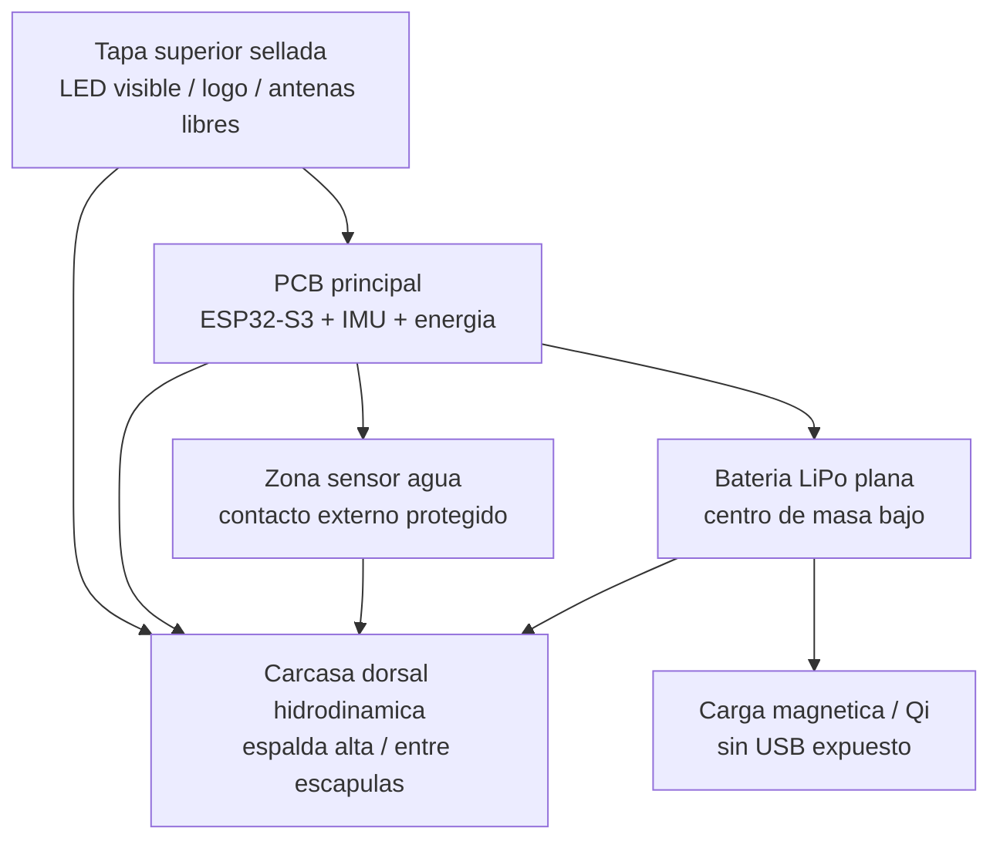
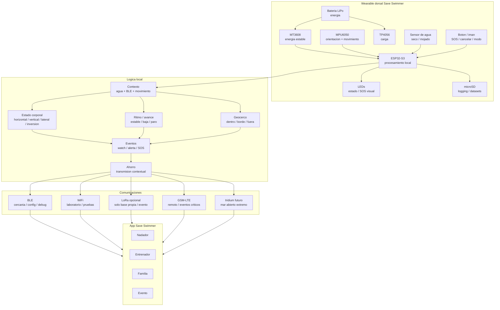
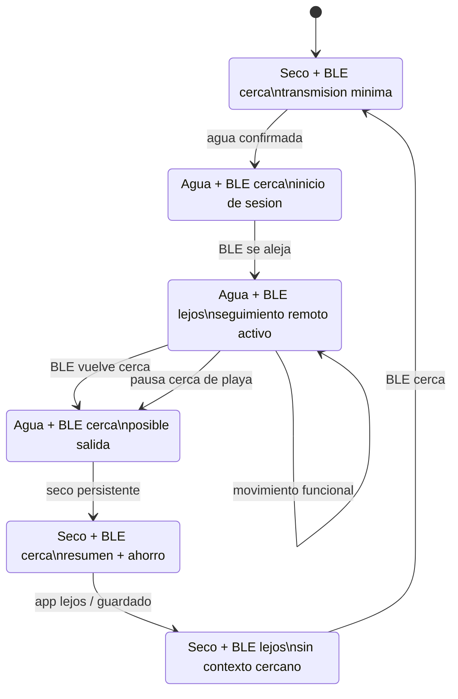
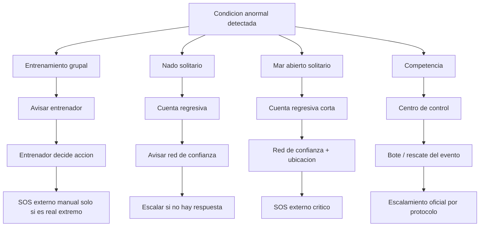
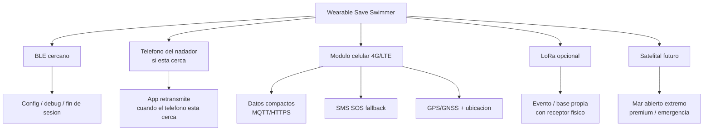
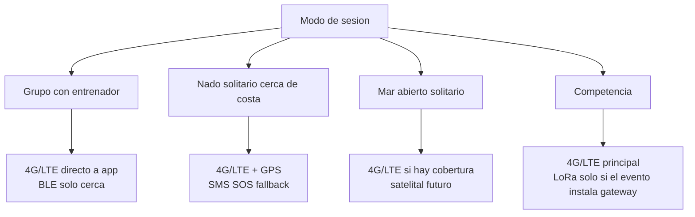

# Save Swimmer - Esquema Vivo

## 0. Schematic Fisico Del Prototipo Actual



### Conexion Actual Recomendada

| Modulo | Pin modulo | ESP32-S3 |
|---|---:|---:|
| MPU6050 | VCC | 3V3 recomendado o 5V si el breakout lo permite |
| MPU6050 | GND | GND |
| MPU6050 | SDA | GPIO SDA definido en firmware |
| MPU6050 | SCL | GPIO SCL definido en firmware |
| Alimentacion prototipo | 5V | VIN / 5V |
| Alimentacion prototipo | GND | GND comun |

Nota: si el MPU6050 es breakout tipo GY-521, normalmente acepta 5V por regulador integrado, pero para PCB final conviene revisar nivel logico y alimentar sensores a 3V3 cuando corresponda.

## 0.1 Schematic Fisico Previsto



## 0.2 Bloques Fisicos En El Wearable



## 1. Esquema Del Dispositivo



## 2. Maquina De Contexto Agua + Bluetooth



## 3. Arbol De La App

```mermaid
flowchart TB
  APP["Save Swimmer App"]

  APP --> LOGIN["Elegir acceso / rol"]

  LOGIN --> NADADOR["Modo Nadador"]
  LOGIN --> ENTRENADOR["Modo Entrenador"]
  LOGIN --> FAMILIA["Modo Familia"]
  LOGIN --> EVENTO["Modo Evento"]

  NADADOR --> N1["Iniciar sesion"]
  NADADOR --> N2["Elegir tipo de nado"]
  NADADOR --> N3["Compartir con entrenador / familia"]
  NADADOR --> N4["Mapa + geocerco"]
  NADADOR --> N5["Resumen post-nado"]
  NADADOR --> N6["Historial personal"]
  NADADOR --> N7["Configuracion SOS"]

  N2 --> NG["Entrenamiento grupal"]
  N2 --> NS["Nado solitario"]
  N2 --> NM["Mar abierto solitario"]
  N2 --> NE["Competencia / evento"]

  ENTRENADOR --> E1["Lista plegable de alumnos"]
  ENTRENADOR --> E2["Mapa grupal desde playa"]
  ENTRENADOR --> E3["Geocerco de entrenamiento"]
  ENTRENADOR --> E4["Atleta seleccionado"]
  ENTRENADOR --> E5["Ritmo cada 100 m"]
  ENTRENADOR --> E6["Accion sugerida"]
  ENTRENADOR --> E7["Alertas internas"]
  ENTRENADOR --> E8["Historial compartido"]

  E1 --> EA["Alumnos con dispositivo"]
  E1 --> ES["Sesiones compartidas"]
  E1 --> EL["Alertas del grupo"]

  FAMILIA --> F1["Estado simple"]
  FAMILIA --> F2["Agua + BLE"]
  FAMILIA --> F3["Ultima ubicacion"]
  FAMILIA --> F4["Notificaciones"]
  FAMILIA --> F5["Red de confianza"]

  EVENTO --> EV1["Acceso por evento"]
  EVENTO --> EV2["Mapa publico / staff"]
  EVENTO --> EV3["Atletas visibles"]
  EVENTO --> EV4["Alertas organizacion"]
  EVENTO --> EV5["Historial del evento"]
  EVENTO --> EV6["Reporte / exportacion"]
```



## 4. Escalamiento SOS Por Modo



## 5. Principio De Diseno

El dispositivo procesa localmente y transmite segun contexto.

- IMU cruda: laboratorio, BLE o microSD.
- App entrenador: lenguaje humano, no ejes de sensor.
- Familia: tranquilidad y estados simples.
- Evento: supervision operativa.
- SOS externo: ultima capa, dependiente del modo de sesion.

## 6. Estrategia De Comunicacion Sin Base LoRa Publica

LoRa no debe ser parte del flujo principal de entrenador para venta al publico.

Un telefono comun no puede recibir LoRa directamente. Para usar LoRa haria falta:

- un receptor LoRa fisico conectado al celular por USB/Bluetooth, o
- un gateway LoRa con internet, o
- una base propia instalada en playa/evento.

Eso agrega hardware, soporte y friccion. Por eso LoRa queda como opcion futura para eventos o bases propias, no como requisito para entrenadores.

LoRa solo es util cuando Save Swimmer controla la infraestructura:

- competencia con base/gateway
- embarcacion o punto fijo propio

Para venta al publico no se puede asumir receptor LoRa en playa. La comunicacion debe tener una opcion celular/satelital.



### Opciones Evaluadas

| Opcion | Sirve para | Ventaja | Problema |
|---|---|---|---|
| BLE + telefono | cerca de playa / salida | bajo costo y bajo consumo | no sirve lejos del telefono |
| LoRa propio | competencia / base propia | largo alcance local | requiere receptor/gateway fisico; el celular no lo recibe nativamente |
| 4G LTE Cat-1 / Cat-4 | publico general | red celular disponible, datos y SMS | consumo alto, SIM, antena, cobertura |
| LTE-M | IoT movil eficiente | mejor consumo que LTE clasico | cobertura debe verificarse por operador |
| NB-IoT | mensajes muy pequenos | bajo consumo y buena penetracion | peor para movilidad; no ideal si el nadador se desplaza entre celdas |
| Satelital | mar abierto extremo | cobertura fuera de celular | costo alto, hardware y planes premium |

### Recomendacion Para Save Swimmer



### Politica De Datos

El modulo celular no debe transmitir IMU cruda.

- cada 30-60 s: estado resumido
- inmediato: evento importante
- SOS: ubicacion + estado + timestamp + bateria + modo
- fin de sesion: resumen y apagado/reduccion

Ejemplo paquete SOS:

```json
{
  "device": "SS-LT-000001",
  "mode": "SOLO_OPEN_WATER",
  "event": "SOS_PENDING",
  "lat": -12.1673,
  "lon": -77.0308,
  "water": true,
  "movement": "NO_ADVANCE",
  "last_signal_s": 3,
  "battery": 82,
  "time": "2026-05-16T09:22:10-05:00"
}
```
